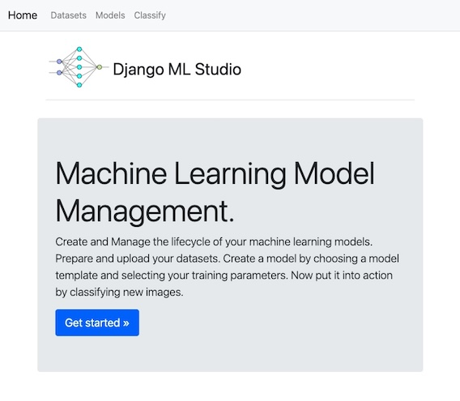

# Django Machine Learning Studio

---

**Django ML Studio** is a web-based lifecycle management platform for machine learning models, designed to make the end-to-end process of building, training, and evaluating image classifiers accessible without writing model code.

**What it does**

Upload a labelled zip file (e.g. folders named cats/ and dogs/) and the platform infers class labels automatically. Users then instantiate a CNN from a template, configure hyperparameters, and launch training from the browser. On completion, a performance dashboard surfaces key metrics and accuracy/loss curves. Users can then upload an unseen image for classification.


---




---


**Roadmap**

The current CNN template is the first in a planned library of neural network architectures covering image, text, and audio classification tasks — with the broader goal of making model experimentation accessible to users who understand their data but not the underlying framework.

---


### Key Features

* Lifecycle management:

      * Quickly create machine learning models with the use of templates
      * Save/delete and retrain models              


* Adjustable training parameters:

      * Learning rate
      * Minimum accuracy
      * Number of epochs


* Performance Metrics:

      * Training v Validation accuracy/loss graphs
      * Key Performance Indicators
          Precision
          Recall
          F1 Score
          Training time

* Automatic label generation:
  

  __NB__ _When uploading training/validation dataset for binary classification. Please structure your zip file as follows._
  
Example:   _cats-v-dogs.zip_

    
      cats_or_dogs
        |
        +- cats
        .  |
        .  +- cat.0.jpg
        .     .
        .     .
        .     .
        .    cat.999.jpg
        .    
        +- dogs
           |
           +- dog.0.jpg
              .
              .
              .
              dog.999.jpg
 
---

### Known Architectural Limitation — Synchronous Model Training

Currently, model training executes synchronously within the HTTP request/response cycle. In a production environment this would cause requests to time out for any reasonably sized dataset. The solution is to decouple training from the web layer by queuing training jobs with Celery and a message broker such as Redis, allowing training to run asynchronously as a background task. This would also require a polling or WebSocket mechanism to notify the user when training completes.


 
___


## Local Development

The recommended way to run the application is via Docker (see below), which works on any platform without any dependency configuration.

If you want to develop locally without Docker, the setup depends on your platform due to TensorFlow's platform-specific packaging.

### Apple Silicon (M1/M2/M3)

`requirements.txt` contains `tensorflow` (Linux/x86) which is incompatible with Apple Silicon. Use the provided `requirements-dev-macos.txt` instead.

```bash
python3.9 -m venv venv
source venv/bin/activate
pip install --upgrade pip
pip install -r requirements-dev-macos.txt
python manage.py migrate
python manage.py runserver
```

> `tensorflow-io-gcs-filesystem` is excluded from `requirements-dev-macos.txt` — it has no working Apple Silicon build and is not used by this project.
>
> To enable M-series GPU acceleration during training, uncomment `tensorflow-metal` in `requirements-dev-macos.txt` before installing.

### Linux / Intel Mac

Use `requirements.txt`

```bash
python3.9 -m venv venv
source venv/bin/activate
pip install --upgrade pip
pip install -r requirements.txt
python manage.py migrate
python manage.py runserver
```

___


## Docker


### Build and tag a Docker image
```bash
docker build -t <your_tag_name>/image_classifier .
```

### Start Docker container
```bash
docker run -p 8000:8000 --name <your_container_name> <your_tag_name>/image_classifier

```

